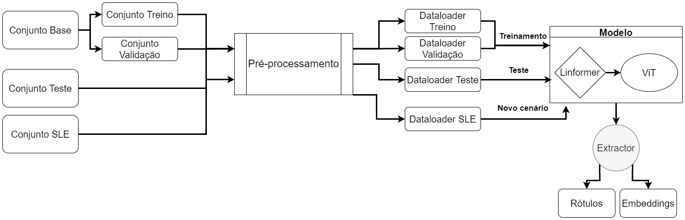

# Projeto 4 – Classificação de lesões de substância branca no Lúpus

## Project 4 – Classification of white matter lesions in Lupus

## Apresentação

O presente projeto foi originado no contexto das atividades da disciplina de pós-graduação [*Ciência e Visualização de Dados em Saúde*](https://ds4h.org), oferecida no primeiro semestre de 2022, na Unicamp.

> |Nome  | RA | Especialização
> |--|--|--|
> | Luiz F. M. Pereira  | 103491  | Computação|

## Introdução

> Apresentação de forma resumida do problema (contexto) e a pergunta que se quer responder.

### Ferramentas

As bibliotecas utilizadas no desenvolvimento desse projeto são listadas abaixo.

* Matplotlib
* Numpy
* Pandas
* Plotly
* Pytorch
* Torchvision
* Umap
* ClassLabel
* Linformer
* SkLearn
* TQDM
* vit_pytorch

### Preparo e uso dos dados

O pré-processamento de dados ocorreu de forma diferente para os diferentes conjuntos. O conjunto disponibilizado no início do projeto foi chamado de Conjunto Base, o Conjunto de Teste corresponde ao conjunto de dados utilizado para avaliar o modelo gerado, e o Conjunto SLE corresponde ao conjunto de dados de lesões de substância branca no cérebro.

As máscaras dos conjuntos foram binarizadas usando o Thresholding de Otsu. Os rótulos foram binarizados usando o método ClassLabel, assim o rótulo 'AVC' foi transformado para 0 e o rótulo 'EM' foi transformado para 1. Para os conjuntos Base e Teste as seguintes operações foram realizadas na imagem base:

  1. Reajuste de contraste automático;

  2. Transformação da imagem em tons de cinza para RGB por meio da cópia de canais;

  3. Redimensionamento para o tamanho de entrada do modelo.

Para o Conjunto SLE foi realizado o mesmo procedimento após a normalização da imagem. A extração de atributos das imagens foi realizada utilizando o [Linformer](https://arxiv.org/abs/2006.04768). O diagrama a seguir sumariza as etapas mencionadas acima.

## Metodologia

O Conjunto Base foi dividido em dois conjuntos: um de treino e outro de validação. A proporção utilizada foi 80% dos pacientes para o conjunto de treino e 20% dos pacientes para o conjunto de validação. O Conjunto Teste e o Conjunto SLE foram fornecidos separadamente e usados para teste e transferência de conhecimento.

O modelo escolhido para tarefa de classificação foi um Visual Transformer (ViT) com uma implementação mais eficiente de Encoder, o Linformer, e extração de Embeddings usando `Extractor`. A imagem abaixo ilustra o pipeline utilizado nesse projeto.

O Linformer possui alguns parâmetros configuráveis que vale a pena destacar, são eles:

* dim: a dimensão do espaço de projeção;
* depth: a quantidade de camadas que o Encoder possui;
* heads: a quantidade de cabeças (correspondente a um Encoder) que analisará a imagem;

de acordo com o artigo do [Linformer](https://arxiv.org/abs/2006.04768), 10 cabeças são o suficiente para qualquer imagem, neste projeto optamos por 8 cabeças, para dim e depth foram utilizados os valores padrões, 512 e 12, respectivamente. Quanto maior o valor para esses parâmetros, maior é o tempo necessário para treinamento e predição do modelo.

Para o modelo ViT também precisamos escolher alguns parâmetros, dentre eles destacamos `image_size` e `path_size`. Para acelerar o treinamento do modelo, fizemos o downsampling na etapa de pré-processamento, o valor escolhido foi 224x224, valor comum de entrada para os ViT. Como estamos trabalhando com imagens pequenas e em um cenário em que queremos prestar atenção em cada pequeno pedaço, definimos um `path_size` de 8 pixels, assim o Transformer conseguirá se ater a pequenos detalhes em cada pedaço da imagem.

A quantidade de épocas definidas para treinamento foi de 50, uma vez que modelos de atenção conseguem extrair características de maneira eficiente até mesmo em cenários few-shot learning. Como métrica de avaliação usamos o loss do modelo, para seu cálculo usamos a implementação do Pytorch de [CrossEntropyLoss](https://pytorch.org/docs/stable/nn.html#crossentropyloss), e a acurácia do modelo, os valores para ambas as métricas está disponível na tabela abaixo.

|                | **Acurácia**  | **Loss**  |
|:-------------: |:------------: |:--------: |
|   **Treino**   |      1.0      |  0.0007   |
| **Validação**  |    0.9750     |  0.0005   |
|   **Teste**    |      1.0      |    0.0    |

O resultado das predições para o conjunto de teste resultaram na matrix de confusão a seguir. Para sua geração, consideramos como corretas todas as labels geradas no experimento anterior.

Além disso, coletamos as embeddings da penúltima camada do modelo, fizemos uma redução de dimensionalidade utilizando [UMAP](https://umap.github.io/umap/), com `n_neighbors=200`, e plotamos os dados em espaços de 2 e 3 dimensões. Perceba que tanto na visualização em 3D quanto 2D os conjuntos estão bem definidos e pode-se separar facilmente os dois conjuntos.

## Resultados Obtidos e Discussão

Na seção anterior, foi apresentado um modelo de atenção que foi capaz de extrair características de maneira eficiente, e que foi capaz de classificar as lesões dos pacientes nas classes AVC, lesões cerebrais isquêmicas, ou EM, correspondente a lesões desmielinizantes. A tarefa proposta nesse projeto foi identificar a etiologia das lesões cerebrais presentes em pacientes de Lúpus Eritematoso Sistêmico (SLE).

O conjunto utilizado para a avaliação da tarefa anterior foi o Conjunto SLE, contendo 697 casos de lesões cerebrais. O modelo desenvolvido anteriormente identificou as lesões SLE como lesões isquêmicas em sua maioria, 662 casos ou cerca de 95% dos casos. Por se tratar de um modelo de atenção, não podemos utilizar técnicas como o Lime para identificar as áreas da imagem mais utilizadas na classificação, uma vez que não são usadas camadas de convolução.

Para avaliar as embeddings geradas, usamos o [UMAP](https://umap.github.io/umap/) para reduzir a dimensionalidade da representação das lesões, e plotamos os dados em um espaço de 2 dimensões. Com base na figura abaixo, podemos observar que não há formação de grupos bem definidos no Conjunto SLE como no Conjunto Teste. O objetivo dessa avaliação é verificar se o modelo gerou representações bem definidas para as lesões.

## Conclusão

Este projeto tinha como objetivo identificar a etiologia das lesões cerebrais presentes em pacientes de Lúpus Eritematoso Sistêmico (SLE), categorizando-as como lesões isquêmicas ou desmielinizantes. Nosso classificador categorizou as lesões SLE como lesões isquêmicas em sua maioria, cerca de 95% dos casos.

As principais dificuldades enfrentadas no desenvolvimento do projeto foram: a) a escolha dos parâmetros do modelo, b) a falta de padronização nos dados, c) a baixa quantidade de implementações usando ViTs, e d) a falta de ferramentas para a avaliação dos resultados. O desenvolvimento deste projeto ressalta a grande dificuldade de realizar pesquisas em imagens na área da saúde, pois diversas fontes de dados são utilizadas, como imagens de diferentes equipamentos, diferentes padrões de anotações na imagem, etc.

Como trabalhos futuros, um novo modelo usando [Dino](https://github.com/facebookresearch/dino) pode ser utilizado, desta vez incluindo detalhes relacionados a explicabilidade do modelo e segmentando lesões de forma mais precisa, sem a necessidade de interferência humana. Além disso, com um maior prazo seria possível comparar as abordagens supervisionadas, não supervisionadas e semi-supervisionadas, traçando um paralelo em relação aos resutlados obtidos.

## Referências Bibliográficas

> Lista de artigos, links e referências bibliográficas (se houver).
>
> Fiquem à vontade para escolher o padrão de referenciamento preferido pelo grupo.
